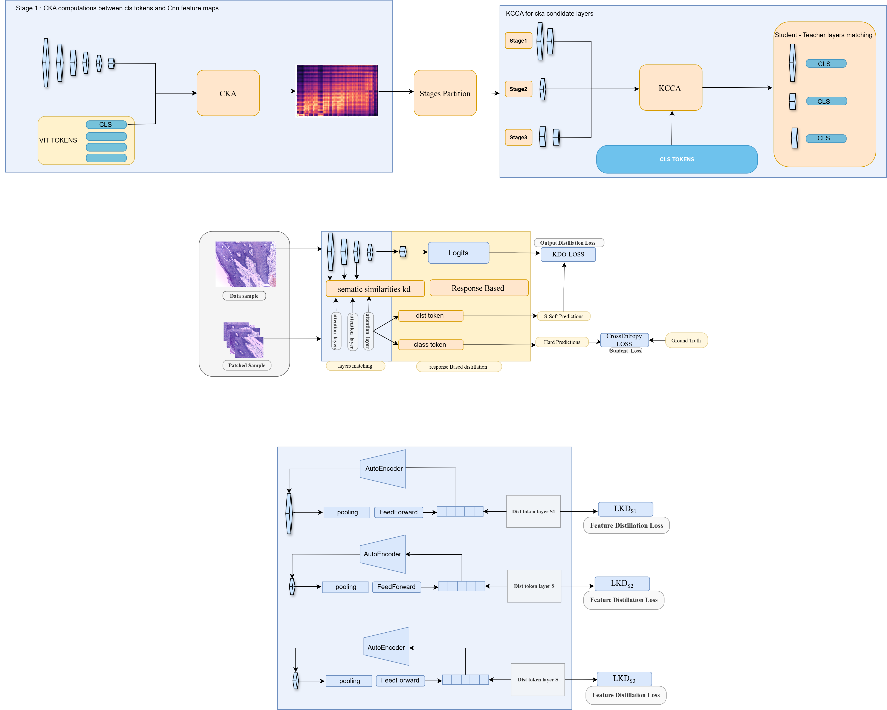

# Adaptive Knowledge Distillation with CKA/KCCA

This repository implements adaptive knowledge distillation for vision models
using representation similarity (CKA, KCCA) to dynamically match teacher and
student layers.(Full code will be soon available !)
#Abstract 

Histopathological image analysis presents unique challenges due to subtle inter-class variations, complex tissue structures, and high intra-class heterogeneity. Convolutional neural networks (CNNs) have traditionally dominated this domain by leveraging strong inductive biases toward locality, while vision transformers (ViTs) have recently emerged as a promising alternative due to their ability to model long-range dependencies. However, ViTs often struggle to capture fine-grained spatial patterns critical to histopathology, particularly when trained on limited data. In this work, we propose a knowledge distillation (KD) framework that transfers spatial and semantic knowledge from a CNN teacher to a ViT student while explicitly addressing representation and spatial misalignment between heterogeneous architectures. We analyze the limitations of conventional feature based distillation methods, which commonly rely on naive layer matching or pixel wise feature alignment, leading to suboptimal knowledge transfer. To overcome these issues, we introduce a principled layer alignment strategy based on representation similarity analysis using centered kernel alignment (CKA) and kernel canonical correlation analysis (KCCA). These measures enable architecture agnostic comparison of internal representations and facilitate the identification of semantically aligned stages between teacher and student models without enforcing strict spatial correspondence. Furthermore, we propose a spatial alignment mechanism that preserves semantic consistency across representations while accommodating architectural differences between CNNs and ViTs, ensuring effective knowledge transfer at both representation and spatial levels. Extensive experiments on the BreakHis histopathological dataset demonstrate consistent performance improvements, particularly across fine-grained subtypes. Notably, our method achieves 98.82\% accuracy using a ViT-Large student with a ResNet152 teacher on the image-wise subtype split, and 96.87\% on the patient-wise split setting, outperforming the best-performing state-of-the-art KD-based methods by 4\% showing the promise of cross architecture KD in computational pathology.

